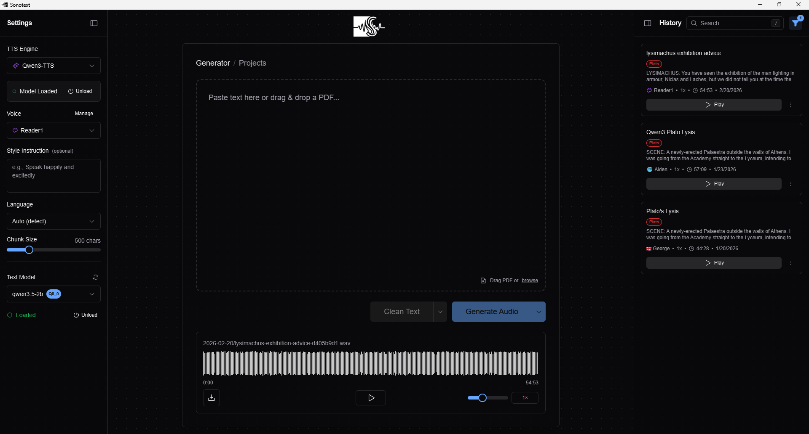

# Sonotext

A local text-to-speech application powered by [Kokoro](https://github.com/hexgrad/kokoro) and [Qwen3-TTS](https://github.com/QwenLM/Qwen3-TTS).



## Features

- **A lotta voices** — For Kokoro, some are okay, and some are terrible. For Qwen, there are only a few, but you can make your own.
- **Multi-language TTS** — You can also control the phonemization language separately.
- **GPU-accelerated** — Uses CUDA. You need it.
    - Uses chunking to handle any size of input text.
- **LLM-based text cleanup** — Optional integration with LM Studio to clean/reformat text before synthesis. Or just strip common markdown formatting.
    - It also auto-names files for you upon generation.
- **History** — Browse/replay/manage previous generations.
- **Audio-text sync** — Click any word to seek. The detail view highlights playback and can auto-scroll.

## Quick Start

### Installation (Windows)

```powershell
# Clone the repo
git clone https://github.com/cep5603/Sonotext.git
cd Sonotext

# Build the portable launcher and install dependencies
.\install.bat
```

Then run `dist\Sonotext\Sonotext.exe`.

The launcher starts the Python backend in the background, opens the app in a WebView2 window, and adds a tray icon. Closing the window minimizes Sonotext to the tray. Right-click the tray icon to open the window, view logs, restart the backend, or quit.

For development, you can still run `start_app.bat` or `.\start_app.ps1` to start the backend and Vite dev server separately.

### LM Studio Integration

1. Install [LM Studio](https://lmstudio.ai/).
2. Load a model and start the local server (default is `http://localhost:1234`).
3. The text cleanup feature should automatically connect after a bit.
